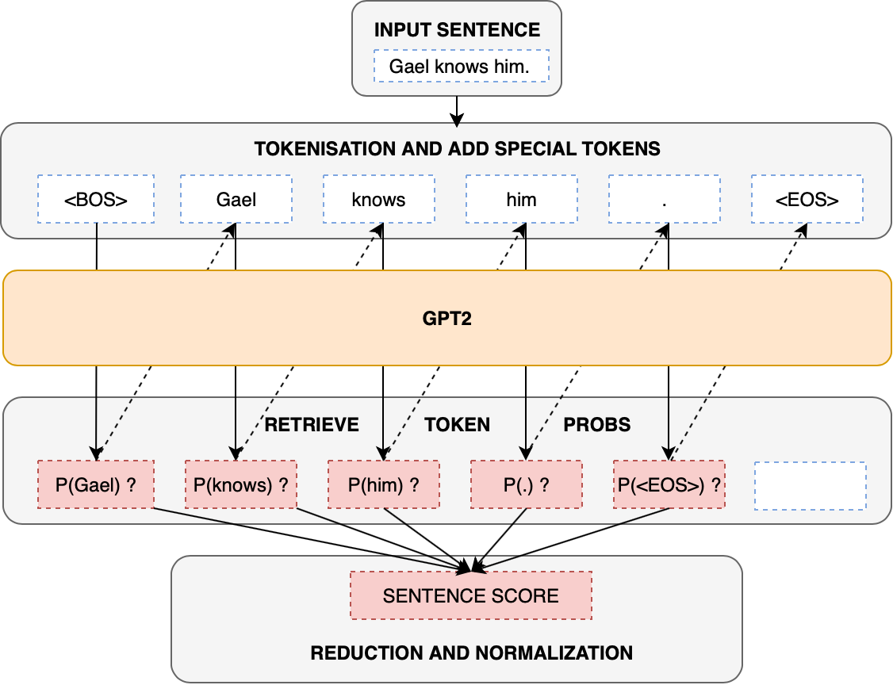
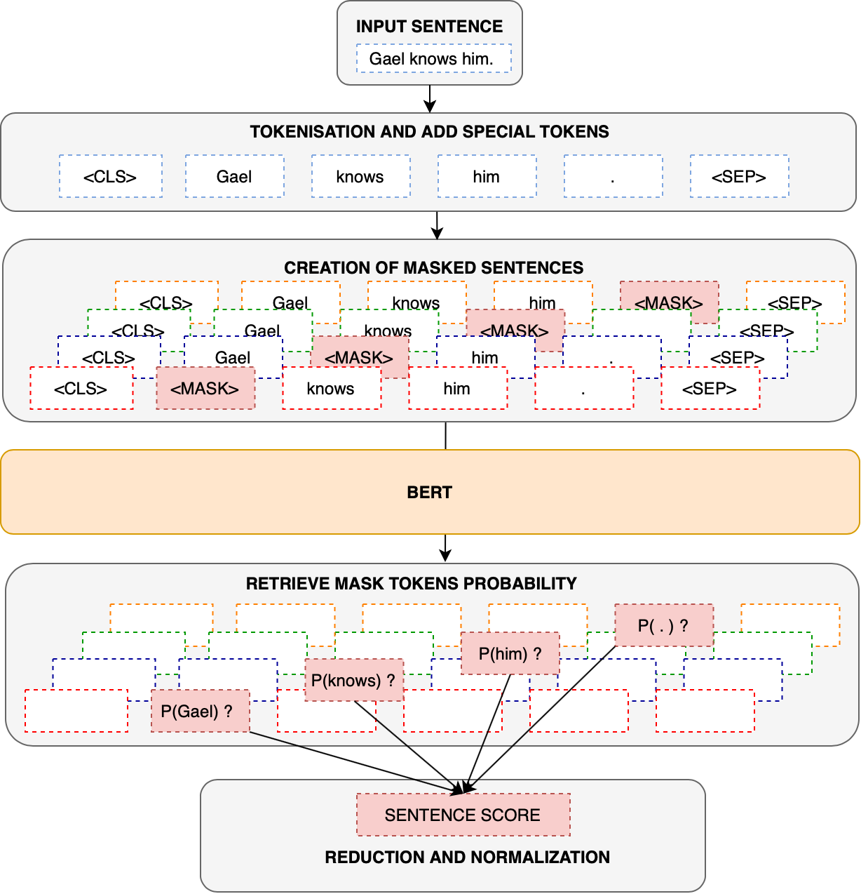
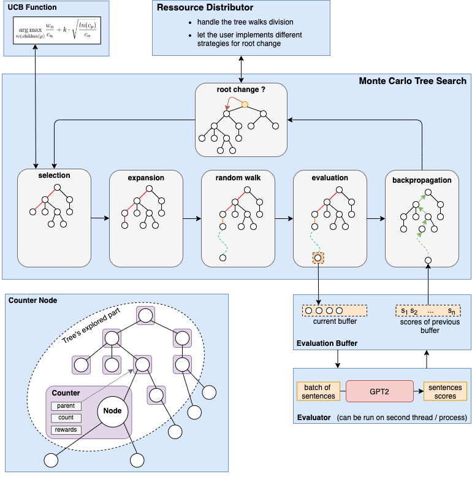

# Project description

The purpose of this package is to find the most *natural* sentence among all sentences 
that can be been generated by a given formal grammar

# Setup

```
git clone https://github.com/dldk-gael/lm-heuristic.git
cd lm-heuristic
pip install .
```


# Package architecture 


<details>
  <summary><b>sentence_score</b></summary>


**sentence_score** provide an interface towards transformers-based model (GPT2 and BERT) that are used to associate a sentence with a *naturalness* score. It is build on top of [huggingface library](https://huggingface.co/transformers/) in order to use the different transformer models.  
Currently two sentences scorer are implemented: one based on unidirectionnal language model (with GPT2) and the other on bi-directionnal language model (with BERT2). Below is a schematic overview of how sentence score is computed from the output of those language models.

GPT2Score           |  BERTScore
:-------------------------:|:-------------------------:
  |  


</details>

<details>
  <summary><b>tree</b></summary>

**tree** defines:
- **tree.Node**, an abstract class from which all tree structure must inheritate. Any object can be a node as soon as it has a *is_terminal* and *children* method. 

- **tree.TreeStats** which can be used to accumulate statistics on a given tree. 
- **tree.interface** which is a submodule used to generate tree.Node object from various type of input data. 
    - **ntlk_grammar.CFGrammarNode** and **nltk_grammar.FeatureGrammarNode** allow the create of tree node from grammars written using nltk specification. The grammars are first processed using nltk grammar parsers and then the trees are generated based on nltk internal representation of such grammar.
    - when using **prolog.PrologGrammarNode**, the grammars are first transformed into prolog predicates and then a **PrologEngine** based on [Pyswip](https://pypi.org/project/pyswip/) is used to compute the nodes and leave of the tree grammar. In order to use this submodule, it is needed to first [install SWI-Prolog](https://www.swi-prolog.org/download/stable).

</details>


<details>
  <summary><b>tree_search</b></summary>

- **tree_search** define:
    - an **tree_search.Evaluator** use to wrap an evaluation function (that takes as input a list of **Node** and return the associated list of scores). Moreover it adds on top of the evaluation function a memory buffer and keep also statistics about the call to the evaluation function. 
    -  an abstract **TreeSearch** from which all tree search strategies must inheritate. A **TreeSearch** object is initialized with an **Evaluator** object. Then given, a root (**tree.Node**) and a number of tree walks that are allowed, it try to search a leave that maximize the **Evaluator** object. 

- **tree_search.mcts** uses Monte Carlo algorithm to perfom the tree search. The algorithm is divide in several submodules :
    - **MonteCarloTreeSearch** which implements the different steps that are at the core of the algorithm (selection, expansion, simulation, evaluation, backpropagation)
    - **CounterNode** that is used by the MCTS to maintain stastistics over the tree nodes. 
    - **EvalBuffer** that allows to evaluate the tree's leave by batch rather that one by one. **ParallelEvalBuffer** makes it possible to run this evaluation is another process / thread. 
    - **RessourceDistributor** that let the user specifies how the computationnal ressource (ie: the tree walks) should be divided

    **Schematic overview of the tree_search.mcts internal working**:

<p align="center"></img></p>

 
- **tree_search.random.RandomSearch** implements a naive search that randomly sample the tree to find the best leaf.

</details>

<details>
  <summary><b>benchmark</b></summary>

- **benchmark** defines an experimentation framework. It takes as input : a list of tree search strategies, 
a dataset of trees, perform different type of evaluation on it and store the results all of the experiments in a panda dataframe.
</details>

<details>
  <summary><b>generation</b></summary>

- **generation** specifies some modules to quickly generate text from grammar or transformers. 
</details>

# Examples

Various examples on how to use all those module can be found in [*examples*](https://github.com/dldk-gael/lm-heuristic/tree/master/examples).

Here is a toy usage.

```python
from lm_heuristic.tree.interface import nltk_grammar
from lm_heuristic.sentence_score import GPT2Score
from lm_heuristic.tree_search import Evaluator
from lm_heuristic.tree_search.mcts import (
    MonteCarloTreeSearch,
    AllocationStrategy,
    RessourceDistributor,
    standart_ucb,
)

GRAMMAR = """
s -> np vp 
np -> 'Gael'
vp -> v obj 
v -> 'knows' | 'know'
obj -> 'Bas' | 'him'
"""

# Generate a tree from a context free grammar
grammar_root = nltk_grammar.CFGrammarNode.from_string(GRAMMAR)
print(grammar_root.children()[0])  # np vp.

# Initialize Sentence scorer
gpt2_scorer = GPT2Score(model_name="gpt2", batch_size=2, length_normalization=True)
gpt2_scorer.build()  # load GPT2 in memory
print(gpt2_scorer(["Gael knows Bas", "Gael know Bas"]))  # => 6.1e-06, 3.6e-06

# Initialize MCTS to search the best leaf of the grammar tree
mcts = MonteCarloTreeSearch(
    evaluator=Evaluator(gpt2_scorer),  # add memoization on top of the sentence scorer
    buffer_size=1,  # to input sentence by batch to the scorer
    ressource_distributor=RessourceDistributor(AllocationStrategy.ALL_FROM_ROOT),
    nb_random_restarts=1,
    ucb_function=standart_ucb,  # specify the selection policy
    parallel_strategy="none",  # use multiprocess to run the evaluation in another process
    progress_bar=True,  # to plot a progress bar
)

# context will be concatenated to the left side of each input sentences
gpt2_scorer.set_context("Who knows Bas ?")  

best_leaf, best_value = mcts.search(grammar_root, nb_of_tree_walks=10)
# => 'Gael knows him.", "4.06e-4"
```


# Server

Contain the scripts to launch flask backend server and celery works that can provide paraphrase generation and grammar sampling. A example of a front-end using this API can be found [here](https://github.com/dldk-gael/grammar_generator). More information on server operation can be found on [server/readme](https://github.com/dldk-gael/lm-heuristic/tree/master/server).
