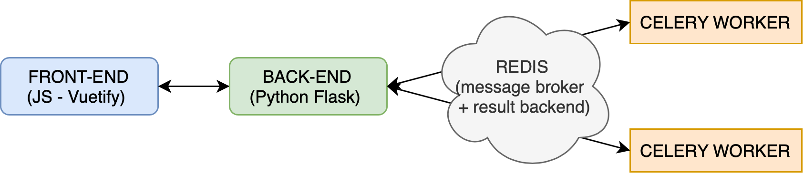

# Context

This module is used to launch a flask backend server and celery worker. 
It is made to work with [grammar_generator](https://github.com/dldk-gael/grammar_generator) front-end. 

The goals of this backend server is to provide paraphrase generation and grammar sampling (using MCTS or random sampling) to the front-end by using lm_heuristic library. 

# Architecture

The following server architecture has been used for this project : 



I used Celery workers because it allow:
- the user to easily abort a task 
- to not block flask process with long task as paraphrasing or MCTS.
- to easily control the computationnal ressource we want to provide.


Redis is used for communication between the flask server and the workers. 

Concretely, when the user will ask for paraphrase generation:
1. the front-end query the back-end using HTTP/POST request 
2. the back-end will create a celery task and return to the front-end the task id
3. the front-end will then regularly query the back-end to get update on task progress and when the task has succeed will get the results.

# Launch server 

1. Install [redis](https://redis.io/topics/quickstart) and [SWI-Prolog](https://www.swi-prolog.org)
2. if not done yet : 
```
git clone https://github.com/dldk-gael/lm-heuristic.git
cd lm-heuristic
pip install .
```
3. Download the weight of [Universal Sentence Encoder](https://tfhub.dev/google/universal-sentence-encoder/4) model and place them in *model_weights* folder under the name *universal_sentence_encoder*. 
4. go the server folder 
```
cd server
```
5. Configure batch size and gpt2 model you want to use for sentence ranking and paraphrasing in [tasks.py](https://github.com/dldk-gael/lm-heuristic/blob/master/server/grammar_backend/tasks.py). 
6. launch flask and celery workers 
```
./grammar_backend.sh 
```
By default, it will launch 2 celery workers:
- one that will only be used to run task that need LM. This one will not be allowed to launch several process to avoid the use of too much memory 
- one that will handle all the other tasks (for now just the random sampling)

## (Optionnal) Use Standford CoreNLP parser 

This API also allows the use of CoreNLP parser (via NLTK) in order to get a constituent parse tree of the paraphrase that have been generated.

In order to use this feature : 
1. [Install java](https://www.java.com/fr/download/help/download_options.xml)
2. [Download CoreNLP](https://stanfordnlp.github.io/CoreNLP/download.html)
3. From CoreNLP directory, launch the CoreNLP server :
```
java -mx4g -cp "*" edu.stanford.nlp.pipeline.StanfordCoreNLPServer -port 9000 -timeout 15000
```
